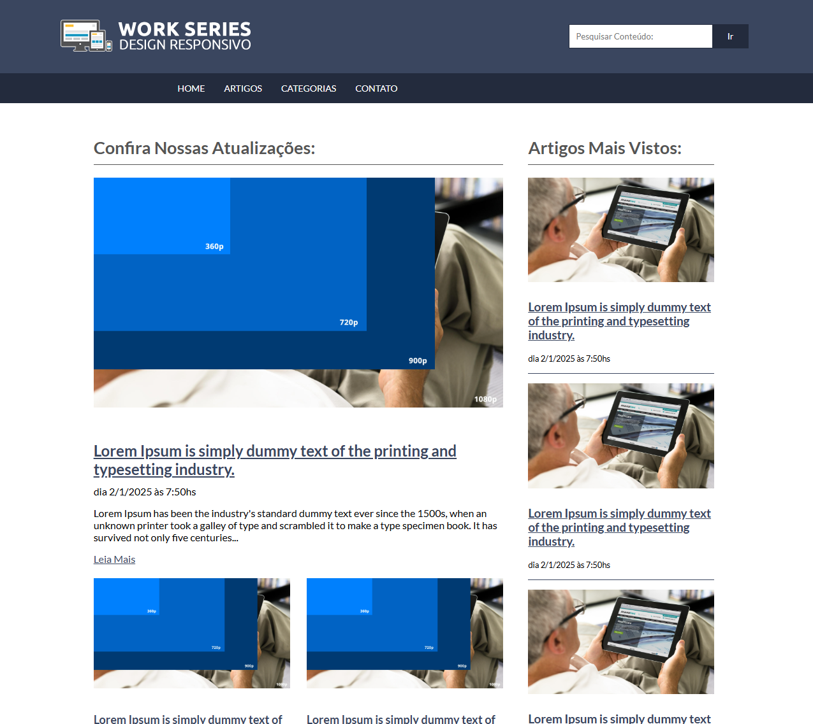

# Projeto de Design Responsivo

Este projeto foi desenvolvido com o objetivo de praticar e demonstrar o uso de técnicas de design responsivo em websites. O design responsivo garante que o conteúdo da página seja exibido corretamente em diferentes dispositivos e tamanhos de tela.

## Objetivos do Projeto

- Aplicar técnicas de design responsivo usando HTML5 e CSS3.
- Demonstrar boas práticas de layout fluido e design adaptativo.
- Melhorar a acessibilidade e a experiência do usuário em dispositivos móveis.

## Tecnologias Utilizadas

- HTML5
- CSS3
- JavaScript

## Como Usar

1. Clone este repositório.
2. Abra o arquivo `index.html` em seu navegador.
3. Explore as páginas e observe o uso de técnicas de design responsivo.

## Contribuições

Contribuições são bem-vindas! Sinta-se à vontade para abrir issues ou enviar pull requests com melhorias e sugestões.
